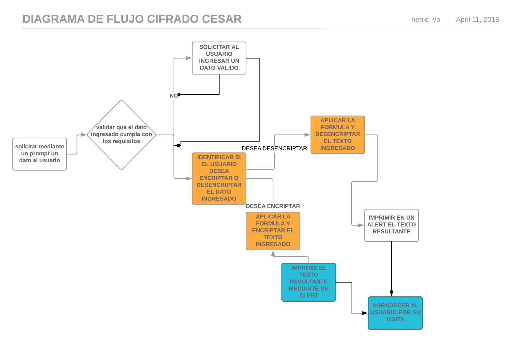

# Cifrado Cesar

## PROGRAMACIÓN BÁSICA
### Objetivo

Despues de aprender programacion basica en este reto se pretende poner en practica lo aprendido asta el momento en las unidades:
* LA LÍNEA DE COMANDOS Y GIT
* ARREGLOS (ARRAYS)
* OBJETOS (OBJECTS)

Asi como Aplicar lo aprendido creando un programa que tenga una aplicación en nuestra vida cotidiana.

### **Descripcion**

Se crea una web que pida, por medio de un input(), una frase al usuario y devuelva el mismo mensaje encriptado según el algoritmo de Cifrado César con el parámetro de desplazamiento de 33 espacios hacia la derecha
Por ejemplo:
Texto original: ABCDEFGHIJKLMNOPQRSTUVWXYZ
Texto codificado: HIJKLMNOPQRSTUVWXYZABCDEFG
Nota : para poder resolver el problema se utilizara lo siguiente
charCodeAt(); te da la letra en codigo ASCII
string.fromCharCode(); te devuelve la letra desde ASCII

### **Pseudocodigo**

Mediante un input solicitar al usuario ingresar un dato valido para cifraro descifrar.
Validar que el dato ingressado cumpla con los requisitos (no contener numeros o caracteres extraños y no estar vacio)
si el usuario desea encriptar el texto convertir el dato ingresado utilizando el cifrado Cesar.
Retornar el texto resultante del paso anterior.
Consideraciones Específicas

El programa debe ser capaz de cifrar y descifrar tanto letras mayúsculas como minúsculas. La fórmula para descifrar es: (x - n) % 26
Tu código debe estar compuesto por 2 funciones con los siguientes nombres: cipher y decipher
El usuario no debe poder ingresar un campo vacío o que contenga números

### **Requerimientos**

_El programa debe ser capaz de cifrar y descifrar tanto letras mayúsculas como minúsculas._

_La fórmula para descifrar es: (x + n) % 26
La formula para cifrar es : (x-65 + n)%26 +65_
El código debe estar compuesto por 2 funciones con los siguientes nombres: cipher y decipher
El usuario no debe poder ingresar un campo vacío o que contenga números

### Diagrama de flujo

